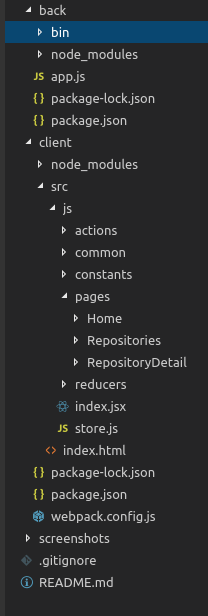

# github-graphql-react-apollo-redux-expressjs

### It's a mini platform that allow users to login using github account. After a successful login, the user can list his repositroies. Once the user choose the repository he can explore its contents, start/unstar it and watch/unwatch it.

## 1. technologies
#### Backend side (we need it for login to send the token to client): nodejs, expressjs 
#### Client: react, apollo, redux, react-router, 

## 2. how to run
#### 2.1 Go to back then run 'npm install', then 'npm start'
#### 2.2 Go to client and run 'npm install', then 'npm run dev'
#### 2.3 navigate tp http://127.0.0.1:8080

## 3. Code Structure:

#### The express code is contained in 'back', react code contained in client.

